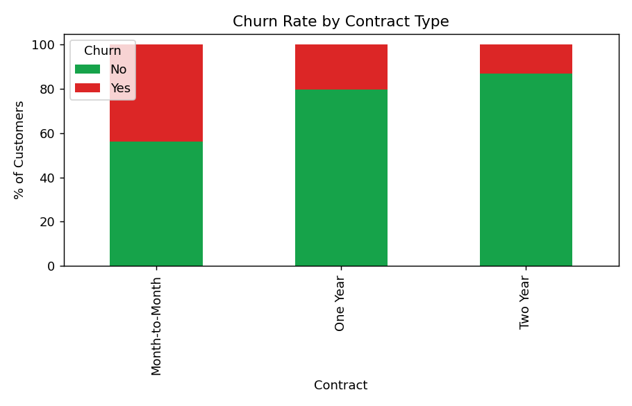
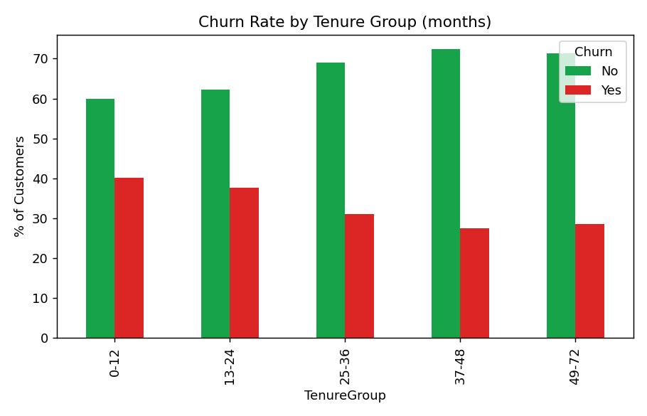
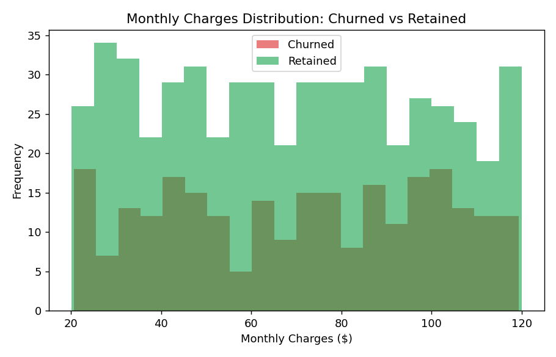

# Customer Churn Analysis

An end-to-end analysis of customer churn for a subscription-style business —
identifying which segments are most at risk and what's driving them to leave.
Built to demonstrate a complete Data Analyst workflow: SQL, Python (EDA +
visualization), and business storytelling.

## Tech Stack
- **SQL** — churn-rate aggregation by segment (`queries.sql`)
- **Python (Pandas, Matplotlib)** — EDA and visualization (`analysis.py`)

## Dataset
`data/customer_churn.csv` — 800 customers with fields:
`CustomerID, Gender, SeniorCitizen, Tenure, Contract, InternetService, PaymentMethod, MonthlyCharges, TotalCharges, Churn`

## Key Findings

**1. Overall churn rate: ~32%** — meaningful revenue risk for the business.

**2. Contract type is the strongest churn driver** — Month-to-Month customers
churn at ~44%, vs ~20% for One Year and ~13% for Two Year contracts. Customers
without a long-term commitment are far more likely to leave.

**3. Early tenure is highest risk** — customers in their first 12 months churn
at ~40%, compared to ~28-29% for tenures beyond 36 months. Retention efforts
matter most in the first year.

**4. Higher monthly charges correlate with higher churn** — churned customers
skew toward the higher end of the monthly charges distribution, suggesting
price sensitivity or perceived lack of value at higher price points.

## Visuals

| Churn by Contract | Churn by Tenure | Charges Distribution |
|---|---|---|
|  |  |  |

## Recommendations
1. **Incentivize longer contracts** — offer a discount or perk for switching
   from Month-to-Month to One/Two Year plans.
2. **Strengthen onboarding & early engagement** — the first 12 months are the
   highest-risk window; a structured onboarding/check-in program could reduce
   early churn.
3. **Review pricing for high-charge tiers** — investigate whether higher-cost
   plans are perceived as good value, or if a loyalty discount would help
   retention.
4. **Build a churn-risk scoring dashboard** (Power BI) using these same
   segments so retention teams can proactively target at-risk customers.

## How to Run
```bash
pip install pandas matplotlib
python analysis.py
```

For SQL, load `data/customer_churn.csv` into any SQL engine as a table named
`customer_churn` and run `queries.sql`.

## Project Structure
```
.
├── data/
│   └── customer_churn.csv
├── analysis.py
├── queries.sql
├── churn_by_contract.png
├── churn_by_tenure.png
├── charges_distribution.png
└── README.md
```

---
**Author:** Harsh Pandey — Data Analyst | Excel | SQL | Python | Power BI
[LinkedIn](https://linkedin.com/in/harsh-pandey-395a10237)
